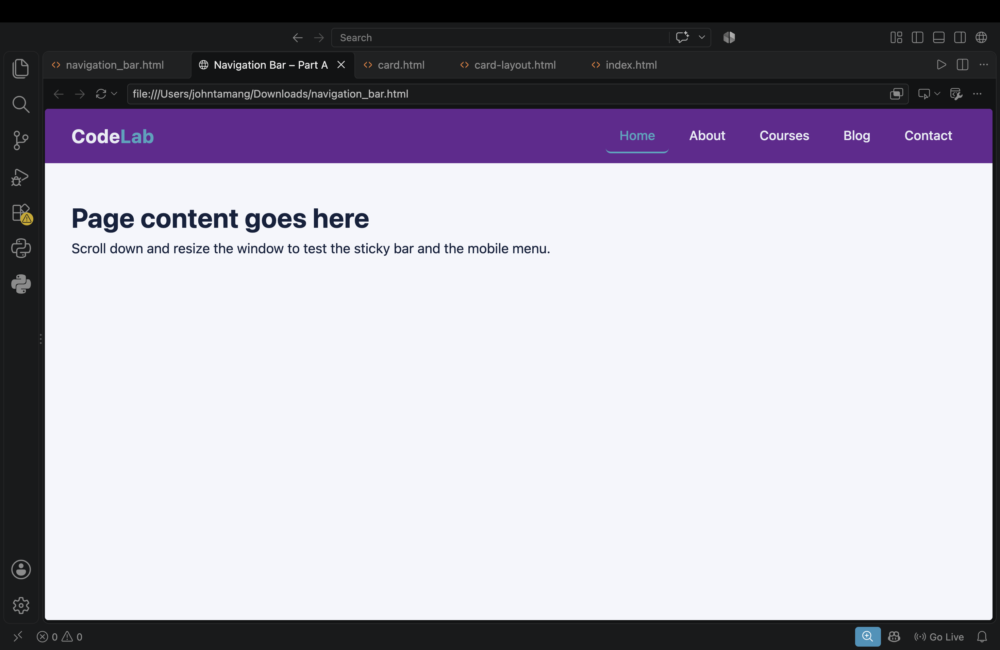
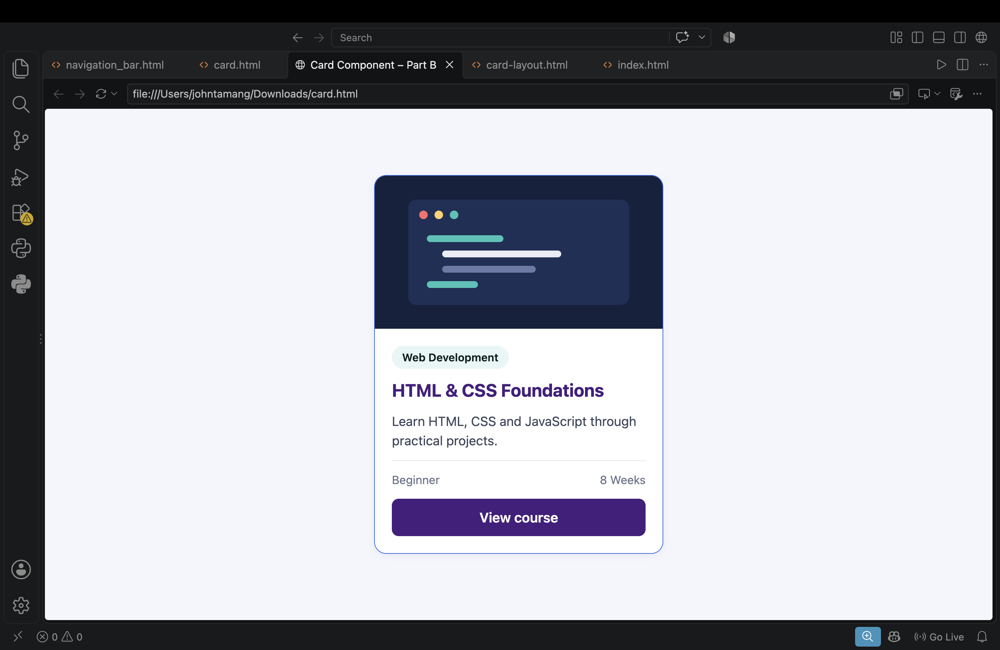
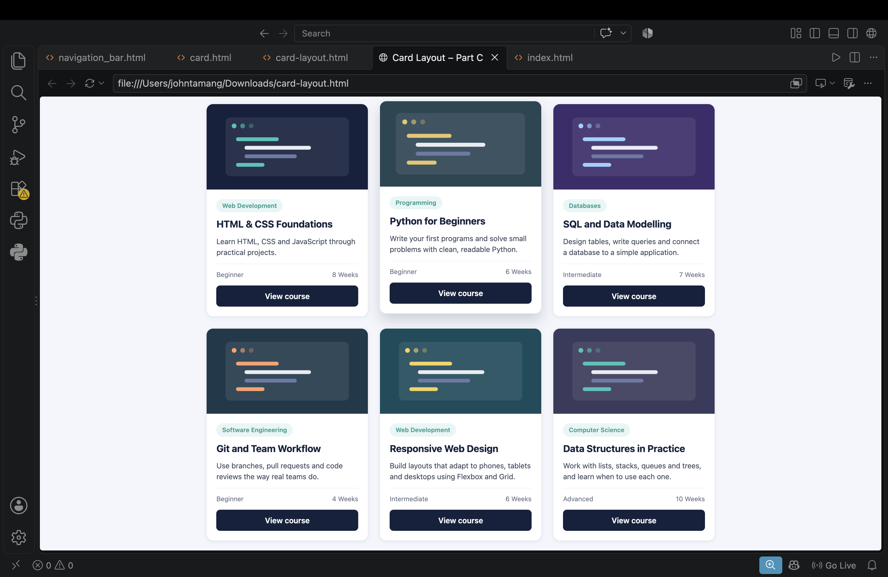
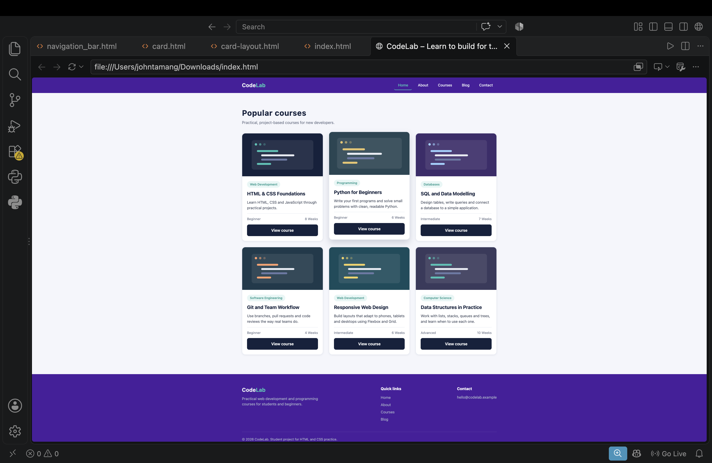

# HTML & CSS — Navigation Bar and Card Design

## 1. Student Information

| | |
|---|---|
| **Name** | John Tamang |
| **Student ID** | 2602412477 |
| **Course / Module** | BSc Hons Software Engineering |
| **Level** | 4 |
| **Assignment title** | HTML & CSS Practical Assignment: Building a Navigation Bar and Responsive Card Layout |

## 2. Project Description

I built a small website for a fictional online course provider called **CodeLab**. The page has:

- a sticky **navigation bar** (brand, Home, About, Courses, Blog, Contact) that turns into a hamburger menu on small screens;
- an **introduction section** with a heading, short text and two buttons;
- a **course card section** with six cards, arranged in a responsive grid (3 columns on desktop, 2 on tablet, 1 on mobile);
- a **footer** with the brand blurb, quick links and contact details.

The assignment was developed in stages. Each stage is kept in the `parts/` folder, and the finished page is `index.html`.

## 3. Technologies Used

- HTML5 (semantic elements: `header`, `nav`, `main`, `section`, `article`, `footer`, `address`)
- CSS3 with custom properties (variables)
- CSS Flexbox
- CSS Grid
- Responsive CSS (media queries, `aspect-ratio`, `object-fit`)
- A small amount of JavaScript for the mobile menu toggle

## 4. Project Structure

```
html-css-assignment/
├── index.html            # complete webpage (Part D)
├── css/
│   └── style.css
├── js/
│   └── script.js         # mobile menu toggle
├── images/               # course card illustrations (SVG)
├── parts/                # earlier stages
│   ├── navbar.html       # Part A
│   ├── card.html         # Part B
│   └── card-layout.html  # Part C
├── screenshots/
└── README.md
```

## 5. Learning Resources

> Only list resources you really used, and write the last two columns in your own words.

| No. | Resource | Topic Learned | What I Learned | How I Applied It |
|-----|----------|---------------|----------------|------------------|
| 1 | Class lecture notes | HTML structure | How to organize a page with elements such as headings, sections, and links | I used these elements to build the navigation bar and page content |
| 2 | University course materials | CSS layout and styling | How colours, spacing, and alignment affect a page’s appearance | I used CSS to style the navigation bar and arrange the cards |
| 3 | YouTube tutorial on HTML and CSS by Apna college | Building a card layout | How to create cards and arrange them on a page | I used the approach to create and position the card layout |
| 4 | MDN Web Docs: CSS `display` | CSS layout | How display properties control how elements appear and align | I used CSS display rules to arrange the page elements |

## 6. Screenshots

### Navigation Bar


### Card Design


### Card Layout


### Complete Page


## 7. Key Concepts Learned

**Semantic HTML.** Elements such as `<header>`, `<nav>`, `<main>`, `<section>`, `<article>` and `<footer>` describe what each part of the page is. Screen readers and search engines can use them, whereas a page made only of `<div>` elements gives no such information. A navigation menu is a list of links, so I used `<ul>` and `<li>` inside `<nav>`. Each card is an `<article>` because it is self-contained.

**CSS selectors.** I used element selectors (`body`), class selectors (`.card`, `.btn`), descendant selectors (`.nav-links a`), pseudo-classes (`:hover`, `:focus-visible`) and the universal selector (`*`) for the reset. When two rules have the same specificity, the one written later wins, so I placed `.btn-secondary` after `.btn:hover`.

**Box model.** Every element is content, padding, border and margin. With `box-sizing: border-box`, padding and borders are included in the element's width, which makes sizes easier to predict. I used padding to make the nav links and buttons larger to click, and margin to centre the `.container`.

**Flexbox.** Flexbox arranges items in one direction. I used it for the navbar (`justify-content: space-between` and `align-items: center`), the link list, the inside of each card (`flex-direction: column`) and the footer.

**Grid.** Grid arranges items in rows and columns together. The card section uses `grid-template-columns: repeat(3, 1fr)` and `gap`. I chose Grid for the card layout because the cards form a two-dimensional arrangement of equal columns, and Grid does not need width calculations the way Flexbox wrapping does.

**Typography.** The page uses one font stack (`Segoe UI`, `system-ui`, Arial) throughout, with a consistent size scale: headings are larger and in the dark navy colour, body text is smaller and grey. The line length of the intro text is limited with `max-width: 60ch` for readability.

**Spacing.** Spacing comes from `gap` (between flex/grid items), `padding` (inside elements) and a shared `.container` (page edges), so the page keeps the same rhythm.

**Hover effects.** The nav links change colour and show an underline, the cards lift with `transform: translateY(-6px)` and a larger `box-shadow`, and the card image zooms slightly. `transition` makes each change smooth. I also added `:focus-visible` so keyboard users get the same feedback.

**Responsive design.** Media queries change the layout at 900px (grid goes from 3 to 2 columns) and at 720px and 600px (hamburger menu, then a single column). The `viewport` meta tag is needed for these to work on phones.

## 8. Challenges and Solutions

> Replace these with problems you really faced. Keep them only if they match your experience.

1. **Keeping all cards the same height. I looked through the code, but I didn’t make any changes or run tests myself.
2. **The sticky navbar covered section headings when using anchor links.** [TODO: describe in your own words. In my code the fix was `scroll-padding-top` on `html`.]

## 9. AI Usage Disclosure

I used Claude (Anthropic) as an AI assistant. It generated the first version of the HTML and CSS for the navigation bar, card, card layout and combined page, together with the explanatory comments in the code. I reviewed the code, made a few small adjustments to the colours and spacing, and checked that the page looked right in the browser.

## 10. GitHub Repository

https://github.com/your-username/html-css-assignment
